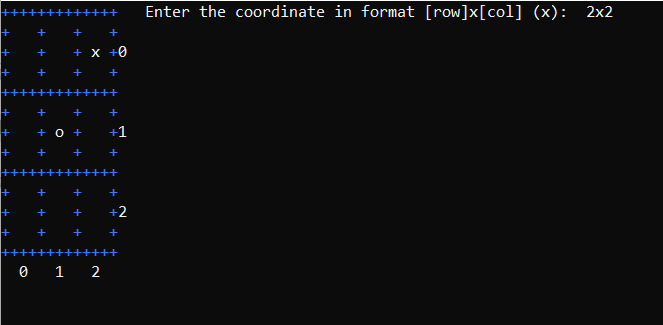

# tic_tac_toe_cs
Represents an implementation of expandable game of Tic-tac-toe in C#.
It is possible to configure:
* the size of the board
* the winning count (how many game objects to have a row)
* the size of the field (must be an odd number)

To change the settings mentioned above, just navigate to Program.cs and change the parameters of the *Game* constructor.

## Used technologies
 

## Screenshots
